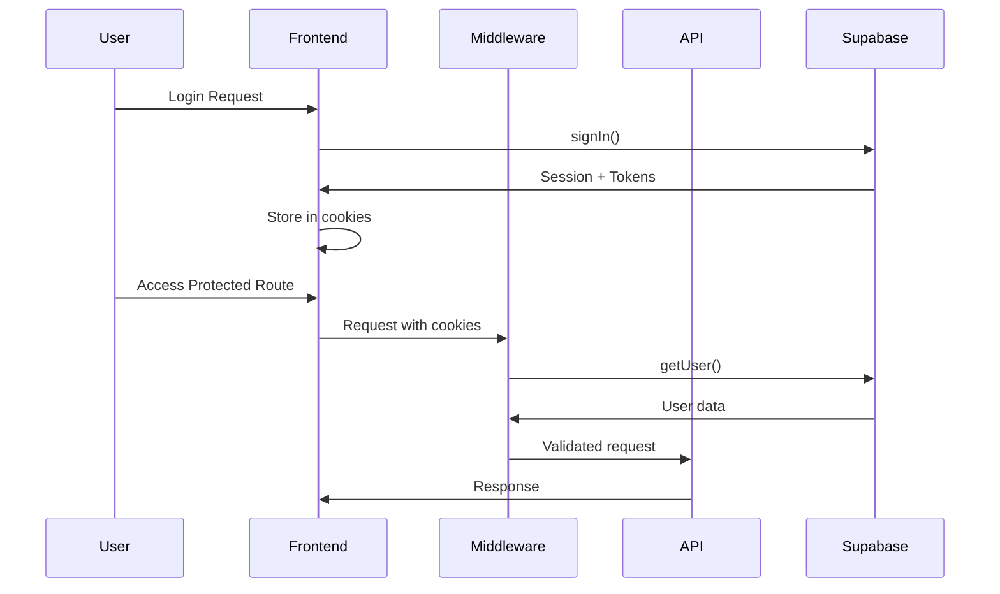
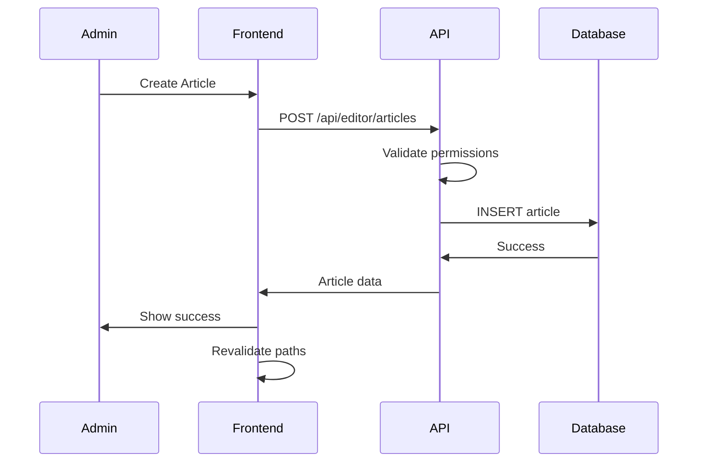

# CMS Implementation Guide - Voice of UPSA News Website

## Overview
This guide provides a comprehensive roadmap for implementing a secure, scalable Content Management System (CMS) for the Voice of UPSA news website using Next.js, TypeScript, and Supabase.

## Project Context
- **Framework**: Next.js (Pages Router)
- **Database**: Supabase (PostgreSQL with RLS)
- **Authentication**: Supabase Auth with @supabase/ssr
- **Styling**: TailwindCSS
- **Language**: TypeScript

## Security Audit Summary
Based on the deep audit, the following critical issues were identified:
- 3 files with CMS security explicitly disabled (critical vulnerabilities)
- 11 admin endpoints missing CMS security
- 2 files using manual authentication instead of CMS middleware
- Database RLS policies need configuration
- Authentication token refresh needs proper implementation

## Implementation Plan (44 Tasks)

### Phase 1: Critical Security Fixes (High Priority)
**Tasks CMS-001 to CMS-018**: Re-enable and add CMS security to all vulnerable endpoints

### Phase 2: Database & Authentication Setup (High Priority)  
**Tasks CMS-019 to CMS-028**: Configure RLS policies, authentication, and middleware

### Phase 3: API & Frontend Security (Medium Priority)
**Tasks CMS-029 to CMS-041**: Implement validation, error handling, and testing

### Phase 4: Production & Documentation (Low Priority)
**Tasks CMS-042 to CMS-044**: Deployment preparation and documentation

## Target Files & Changes

### 1. Critical API Endpoints (Re-enable CMS Security)

#### `pages/api/editor/articles.ts`
```typescript
// BEFORE (Vulnerable):
// Apply error handler only - temporarily disable CMS security to bypass 401 error
export default withErrorHandler(handler);

// AFTER (Secure):
export default withErrorHandler(withCMSSecurity(handler, {
  requirePermission: 'manage:articles',
  auditAction: 'editor_articles_accessed'
}));
```

#### `pages/api/admin/settings.ts`
```typescript
// BEFORE (Vulnerable):
// Wrap with error handler only - temporarily disable CMS security to stop automatic logout
export default withErrorHandler(handler);

// AFTER (Secure):
export default withErrorHandler(withCMSSecurity(handler, {
  requirePermission: 'manage:settings',
  auditAction: 'admin_settings_updated'
}));
```

#### `pages/api/admin/ads.ts`
```typescript
// BEFORE (Vulnerable):
// Wrap with error handler only - temporarily disable CMS security to stop authentication issues
export default withErrorHandler(handler);

// AFTER (Secure):
export default withErrorHandler(withCMSSecurity(handler, {
  requirePermission: 'manage:ads',
  auditAction: 'ads_management_accessed'
}));
```

### 2. Admin Endpoints (Add Missing CMS Security)

Add CMS security to these endpoints:
```typescript
// Pattern for all admin endpoints:
export default withErrorHandler(withCMSSecurity(handler, {
  requirePermission: 'admin:access', // Adjust per endpoint
  auditAction: 'endpoint_specific_action'
}));
```

**Files to update:**
- `pages/api/admin/check-admin-status.ts`
- `pages/api/admin/check-settings-structure.ts`
- `pages/api/admin/create-first.ts`
- `pages/api/admin/field-encryption.ts`
- `pages/api/admin/generate-signed-url.ts`
- `pages/api/admin/rotate-logs.ts`
- `pages/api/admin/run-security-tests.ts`
- `pages/api/admin/security-audit.ts`
- `pages/api/admin/users/sync-all.ts`
- `pages/api/admin/emergency-lockdown.ts`
- `pages/api/admin/debug-users-api.ts`

### 3. Fix Manual Authentication

#### `pages/api/admin/users/index.ts`
```typescript
// BEFORE (Manual Auth):
// Authenticate user from session (since CMS security is disabled)
const authHeader = req.headers.authorization;

// AFTER (CMS Security):
export default withErrorHandler(withCMSSecurity(handler, {
  requirePermission: 'manage:users',
  auditAction: 'admin_users_accessed'
}));
```

#### `pages/api/auth/cms-user.ts`
```typescript
// BEFORE (Basic Auth):
// Use basic authentication instead of complex CMS security
const user = await requireAuth(req);

// AFTER (CMS Security):
export default withErrorHandler(withCMSSecurity(handler, {
  requirePermission: 'view:cms_user',
  auditAction: 'cms_user_info_accessed'
}));
```

## Database Layer Configuration

### Supabase RLS Policies

#### Articles Table
```sql
-- Enable RLS
ALTER TABLE articles ENABLE ROW LEVEL SECURITY;

-- Policy for admins/editers to manage articles
CREATE POLICY "Admins and editors can manage articles" ON articles
  FOR ALL USING (
    auth.uid() = user_id 
    AND EXISTS (
      SELECT 1 FROM user_profiles 
      WHERE user_id = auth.uid() 
      AND role IN ('admin', 'editor')
    )
  );

-- Policy for public to read published articles
CREATE POLICY "Published articles are publicly readable" ON articles
  FOR SELECT USING (is_published = true);
```

#### User Profiles Table
```sql
-- Enable RLS
ALTER TABLE user_profiles ENABLE ROW LEVEL SECURITY;

-- Policy for users to manage their own profile
CREATE POLICY "Users can manage own profile" ON user_profiles
  FOR ALL USING (auth.uid() = user_id);

-- Policy for admins to view all profiles
CREATE POLICY "Admins can view all profiles" ON user_profiles
  FOR SELECT USING (
    EXISTS (
      SELECT 1 FROM user_profiles 
      WHERE user_id = auth.uid() 
      AND role = 'admin'
    )
  );
```

#### Automatic Profile Creation Trigger
```sql
-- Function to create user profile on signup
CREATE OR REPLACE FUNCTION public.handle_new_user()
RETURNS TRIGGER AS $$
BEGIN
  INSERT INTO public.user_profiles (user_id, email, role)
  VALUES (
    NEW.id,
    NEW.email,
    CASE 
      WHEN NEW.email LIKE '%admin@%' THEN 'admin'
      WHEN NEW.email LIKE '%editor@%' THEN 'editor'
      ELSE 'user'
    END
  );
  RETURN NEW;
END;
$$ LANGUAGE plpgsql SECURITY DEFINER;

-- Trigger to create profile on user signup
CREATE TRIGGER on_auth_user_created
  AFTER INSERT ON auth.users
  FOR EACH ROW EXECUTE FUNCTION public.handle_new_user();
```

## Authentication & Session Management

### Client-side Supabase Client (`lib/supabase/client.ts`)
```typescript
import { createClientComponentClient } from '@supabase/auth-helpers-nextjs'
import { Database } from '@/types/database'

export const supabase = createClientComponentClient<Database>()
```

### Server-side Supabase Client (`lib/supabase/server.ts`)
```typescript
import { createServerComponentClient } from '@supabase/auth-helpers-nextjs'
import { cookies } from 'next/headers'
import { Database } from '@/types/database'

export function createClient() {
  const cookieStore = cookies()
  return createServerComponentClient<Database>({
    cookies: () => cookieStore,
  })
}
```

### Enhanced CMS Security Middleware (`lib/security/cms-security.ts`)
```typescript
export async function verifyCMSAccess(req: NextApiRequest): Promise<CMSUser> {
  // Enhanced token validation with multiple fallback methods
  // JWT decode fallback for development
  // Proper session refresh handling
  // Comprehensive logging and audit trails
}
```

## API Route Security Pattern

### Secure API Handler Template
```typescript
import { withCMSSecurity } from '@/lib/security/cms-security'
import { withErrorHandler } from '@/lib/error-handler'

async function handler(req: NextApiRequest, res: NextApiResponse, user: CMSUser) {
  try {
    // 1. Validate request method
    if (req.method !== 'POST') {
      return res.status(405).json({ error: 'Method not allowed' })
    }

    // 2. Validate input data
    const validatedData = schema.parse(req.body)

    // 3. Perform database operation
    const { data, error } = await supabase
      .from('table_name')
      .insert(validatedData)
      .select()

    if (error) throw error

    // 4. Revalidate paths if needed
    // await revalidatePath('/path/to/update')

    // 5. Return success response
    return res.status(200).json({
      success: true,
      data,
      message: 'Operation completed successfully'
    })

  } catch (error) {
    console.error('API Error:', error)
    return res.status(500).json({
      success: false,
      error: 'Internal server error'
    })
  }
}

export default withErrorHandler(withCMSSecurity(handler, {
  requirePermission: 'specific:permission',
  auditAction: 'action_description'
}))
```

## Frontend Security Implementation

### Secure Form Component Template
```typescript
'use client'

import { useState } from 'react'
import { createClient } from '@/lib/supabase/client'
import { useRouter } from 'next/navigation'

export default function SecureForm() {
  const [loading, setLoading] = useState(false)
  const [error, setError] = useState<string | null>(null)
  const supabase = createClient()
  const router = useRouter()

  const handleSubmit = async (formData: FormData) => {
    setLoading(true)
    setError(null)

    try {
      // Get current session
      const { data: { session }, error: sessionError } = await supabase.auth.getSession()
      
      if (sessionError || !session) {
        throw new Error('Authentication required')
      }

      // Submit form data
      const response = await fetch('/api/secure-endpoint', {
        method: 'POST',
        headers: {
          'Content-Type': 'application/json',
          'Authorization': `Bearer ${session.access_token}`
        },
        body: JSON.stringify(Object.fromEntries(formData))
      })

      if (!response.ok) {
        const errorData = await response.json()
        throw new Error(errorData.error || 'Request failed')
      }

      const result = await response.json()
      
      // Success handling
      router.refresh()
      // Or: revalidatePath('/path')
      
    } catch (err) {
      setError(err instanceof Error ? err.message : 'An error occurred')
    } finally {
      setLoading(false)
    }
  }

  return (
    <form action={handleSubmit}>
      {/* Form fields */}
      {error && <div className="error">{error}</div>}
      <button type="submit" disabled={loading}>
        {loading ? 'Processing...' : 'Submit'}
      </button>
    </form>
  )
}
```

## Function Flow Diagrams

### Authentication Flow


### Article Management Flow


## Error Prevention Strategies

### 1. Session Expiration Prevention
- **Problem**: "Session expired or invalid" errors
- **Solution**: Implement automatic token refresh in middleware
- **Implementation**: Use @supabase/ssr with proper cookie handling

### 2. Unauthorized Access Prevention
- **Problem**: Users accessing admin endpoints
- **Solution**: CMS security middleware on all protected routes
- **Implementation**: withCMSSecurity wrapper with permission checks

### 3. Data Validation Errors
- **Problem**: Invalid data causing database errors
- **Solution**: Server-side validation with Zod schemas
- **Implementation**: Input validation before database operations

### 4. Stale Data Issues
- **Problem**: UI showing outdated data after updates
- **Solution**: Proper data revalidation
- **Implementation**: router.refresh() or revalidatePath()

## Testing Checklist

### Authentication Testing
- [ ] User can sign up successfully
- [ ] User can log in with valid credentials
- [ ] Invalid login attempts are rejected
- [ ] Session persists across page refreshes
- [ ] Session expires properly after timeout
- [ ] Token refresh works automatically

### Authorization Testing
- [ ] Admin can access all admin endpoints
- [ ] Editor can access editor endpoints only
- [ ] Regular user cannot access admin endpoints
- [ ] Unauthorized requests return 403 status
- [ ] Audit logs are created for sensitive actions

### Content Management Testing
- [ ] Admin can create articles
- [ ] Editor can edit existing articles
- [ ] Published articles appear on homepage
- [ ] Draft articles are not public
- [ ] Featured articles display correctly
- [ ] Article deletion works properly

### Data Integrity Testing
- [ ] Required fields are validated
- [ ] Invalid data is rejected
- [ ] Database constraints are enforced
- [ ] Concurrent updates handle correctly
- [ ] File uploads work with proper validation

## Production Deployment Checklist

### Environment Variables
```bash
# Required in production
NEXT_PUBLIC_SUPABASE_URL=your_supabase_url
NEXT_PUBLIC_SUPABASE_ANON_KEY=your_supabase_anon_key
SUPABASE_SERVICE_ROLE_KEY=your_service_role_key
CSRF_SECRET=your_csrf_secret
```

### Security Configuration
- [ ] HTTPS enabled in production
- [ ] Secure cookies configured
- [ ] CORS properly configured
- [ ] Rate limiting enabled
- [ ] IP whitelist enabled (if needed)
- [ ] Device approval enabled (if needed)

### Database Setup
- [ ] RLS policies enabled
- [ ] Database functions created
- [ ] Triggers configured
- [ ] Indexes optimized
- [ ] Backups configured

### Monitoring & Logging
- [ ] Error tracking configured
- [ ] Security events logged
- [ ] Performance monitoring
- [ ] Uptime monitoring
- [ ] Database monitoring

## Common Issues & Solutions

### Issue: "Session expired or invalid"
**Cause**: Token not refreshing properly
**Solution**: Ensure @supabase/ssr is configured correctly with cookie handling

### Issue: "Access denied" for valid users
**Cause**: Missing role in user_profiles table
**Solution**: Ensure trigger creates profile on signup

### Issue: "Database constraint violation"
**Cause**: Missing required fields or invalid data
**Solution**: Add proper validation and default values

### Issue: "Stale data after updates"
**Cause**: Cache not invalidated
**Solution**: Implement proper revalidation strategy

## Best Practices

1. **Always use CMS security middleware** for protected endpoints
2. **Validate all inputs** on both client and server side
3. **Implement proper error handling** with user-friendly messages
4. **Use TypeScript** for type safety
5. **Follow the principle of least privilege** for permissions
6. **Log .env.local**  all sensitive data**.
7. . **Regular security audits.
8.  **Keep dependencies updated**
9.
9  ** . **Implement人员进行定期安全审计**</think>
<think></think>
## Conclusion

This comprehensive CMS implementation guide provides a structured approach to securing the Voice of UPSA news website. By following the 44-task implementation plan, you'll achieve:

- **Secure authentication** with automatic token refresh
- **Proper authorization** with role-based access control
- **Database security** with RLS policies and constraints
- **API security** with middleware protection
- **Frontend security** with proper error handling
- **Production readiness** with deployment checklist

The implementation follows security best practices and prevents common issues like session expiration, unauthorized access, and data integrity problems.

**Next Steps**: Begin with Phase 1 (Critical Security Fixes) to address the most urgent vulnerabilities, then proceed through the remaining phases systematically.

---

*This guide should be used in conjunction with the todo list to track progress through each implementation phase.*
